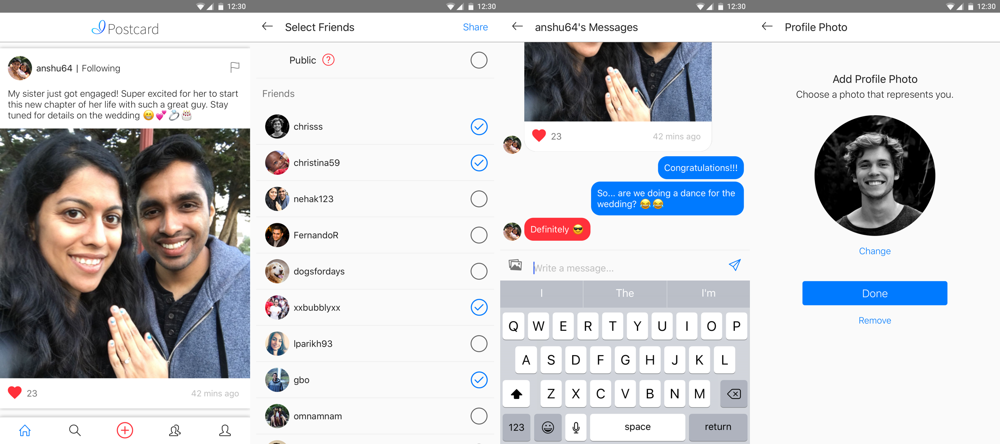

# Postcard
Postcard is a social platform and messenger that encourages you to keep in touch with your friends and family.

* Create a profile with a username and photo
* Share posts directly with friends or make them public
* Like posts to find them later and show others they've been heard
* Follow people who you want to hear more about
* Message your friends directly in private chat

Postcard was developed for Android & iOS in 2018 by Anshuman Dewangan and Vinit Parikh. The code is free for everyone to view, reuse, and evolve. If you do use the code in your own projects, attribution to Anshuman & Vinit would be appreciated. 



# postcard-api
Repository for Postcard's back-end using Ruby on Rails. **Also see [postcard-mobile](https://github.com/anshuman64/postcard-mobile).**

## Setup
1. Open .bash_profile (create the file if it does not exist).
````
open ~/.bash_profile
````
Add the following lines:
````
export ONE_SIGNAL_APP_ID="Ask anshuman64 for the key"
export ONE_SIGNAL_AUTH_KEY="Ask anshuman64 for the key"
export PUSHER_APP_ID="Ask anshuman64 for the key"
export PUSHER_KEY="Ask anshuman64 for the key"
export PUSHER_SECRET="Ask anshuman64 for the key"
export TWILIO_ACCOUNT_SID="Ask anshuman64 for the key"
export TWILIO_AUTH_TOKEN="Ask anshuman64 for the key"
````

## Release
### Quick Release
0. Uncomment all "Debug Test" code (Twilio SMS, OneSignal push notifications, and Puma queue_requests)!
1. Make sure all code is COMMITTED to current branch
1. Run command:
````
eb deploy insiya-production-server-1
````

### Full Release
0. Uncomment all "Debug Test" code (Twilio SMS, OneSignal push notifications, and Puma queue_requests)!
1. Log into AWS Console: https://console.aws.amazon.com/
2. Click "Services" > "Compute" > "Elastic Beanstalk"
3. Click "insiya-production-server-1" or "insiya-production-server-2"
4. Click "Actions" > "Clone Environment"
5. Change "Environment name" to the opposite of the existing environment (1 vs. 2) and click "Clone"
6. Wait for environment to build...
7. Make sure all code is COMMITTED to current branch (or else it gives a warning)
8. Run command:
````
eb deploy insiya-production-server-1
````
9. Wait for environment to update in AWS Console...
10. On Elastic Beanstalk application page, click "Actions" > "Swap Environment URLs"
11. Click "Okay"
12. Done! Production API calls will now be routed to the new, updated environment


### Post-Release
1. Assuming you were on "master" branch:
````
git checkout stable
git merge master
git tag vX.Y.Z
git push
git push origin vX.Y.Z
git checkout master
````
